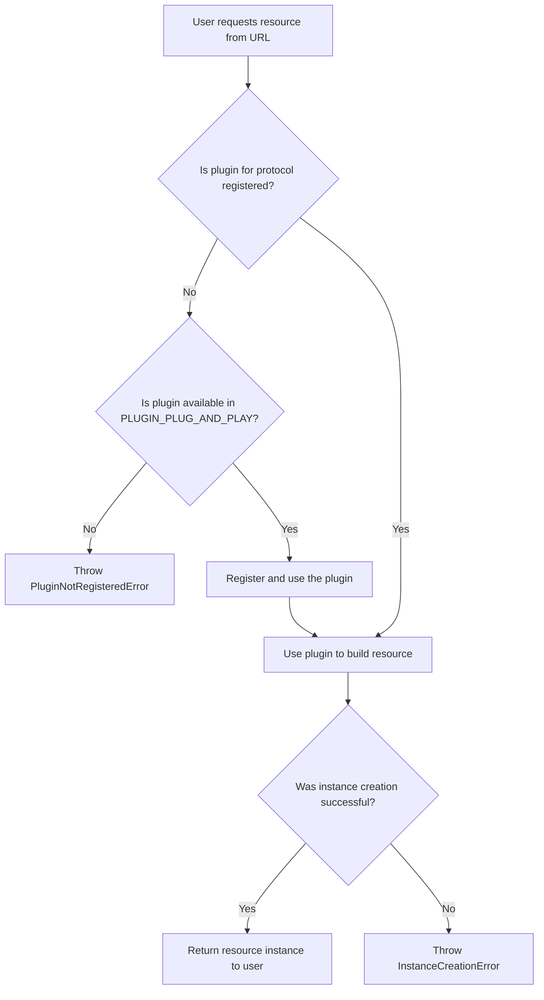
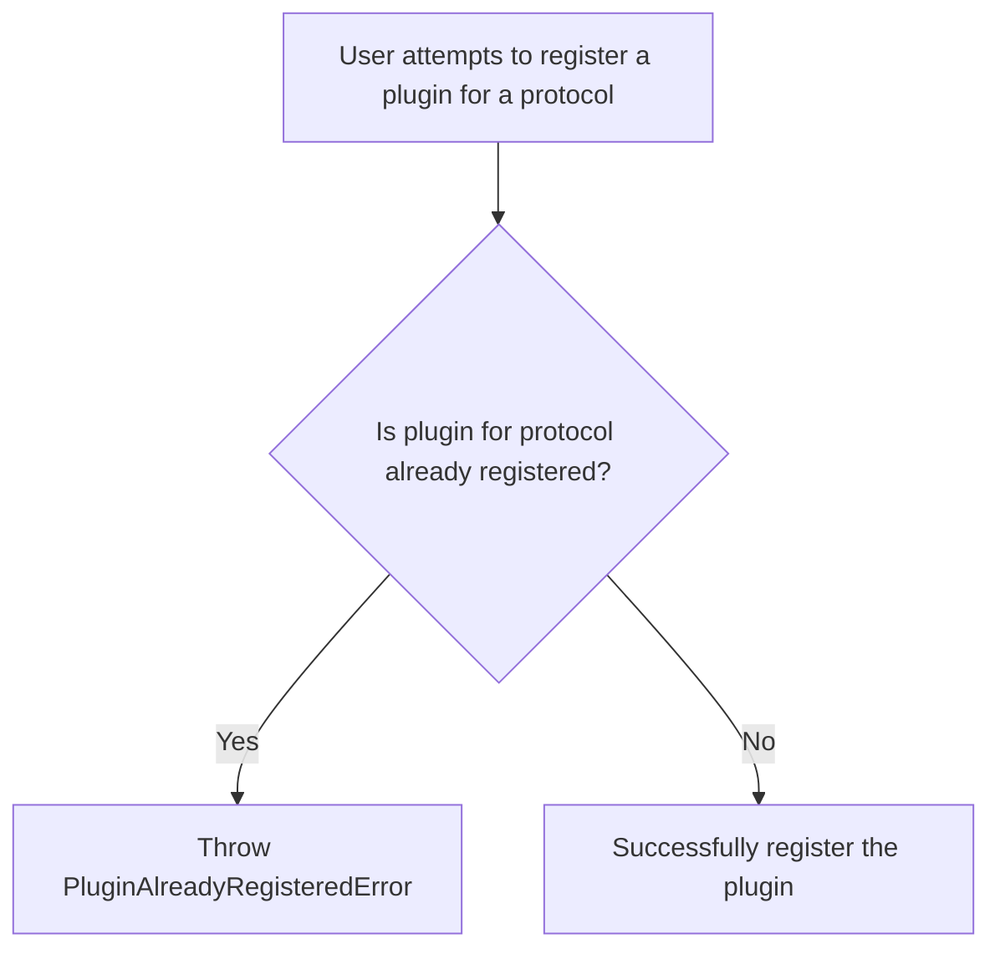

# @pluggable-io/core

This package provides a registry system for resources,
allowing you to register plugins based on specific protocols and construct resource instances from URLs.

This package offers a unified interface for managing various resources.

## Features

- **Resource Registry**

  Create a new registry instance and register plugins for specific protocols.

- **Unified Resource Retrieval**

  Construct resource instances from URLs using registered plugins.

- **Error Handling**

  Handle scenarios where a plugin is already registered or a protocol is not registered.

## Installation

```bash
npm install @pluggable-io/core
```

## Usage

### 1. Importing Types

Import the main types and interfaces provided by `@pluggable-io/core`.

```typescript
import { Registory, ResourcePlugin, PluginNotRegisteredError, PluginAlreadyRegisteredError } from '@pluggable-io/core'
```

### 2. Using the Registory

Create a new registry instance and register plugins.

```typescript
interface SampleResource {
  // ... some interface
}

class SampleResourceRegistory extends RegistoryBase<SampleResource> {
  // ... some custom logic
}

const registory = new SampleResourceRegistory()

registory.registerPlugin('sample:', {
  async build(url) {
    // return a new resource instance
    return new SampleResourceAdapter(url)
  },
})
```

### 3. Retrieving Resources

Retrieve resource instances using registered plugins.

```typescript
const resource = await registory.from('sample://url/of/resource')
```

## Specification

### Instance Creation

The following flowchart describes the process of creating a resource instance:



### 2. Plugin Registration

The following flowchart describes the process of registering a plugin:



## Notes

### Dynamic Plugin Loading

With the `PLUGIN_PLUG_AND_PLAY` mechanism, you can dynamically load plugins.
This allows you to add or modify plugins during runtime.
To utilize this feature, ensure that the plugin you're trying to load is available in the `PLUGIN_PLUG_AND_PLAY` path and then request a resource using its protocol.
The system will automatically detect, load, and register the plugin for you.

## Contributing

Feedback, bug reports, and pull requests are welcome!
